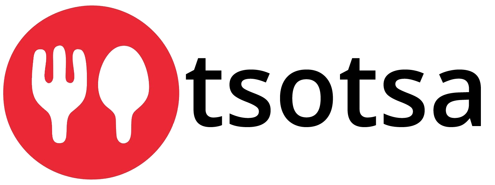

<!-- Templates Credits : https://github.com/othneildrew/Best-README-Template/pull/73 -->

<!-- PROJECT SHIELDS -->
<!--
*** I'm using markdown "reference style" links for readability.
*** Reference links are enclosed in brackets [ ] instead of parentheses ( ).
*** See the bottom of this document for the declaration of the reference variables
*** for contributors-url, forks-url, etc. This is an optional, concise syntax you may use.
*** https://www.markdownguide.org/basic-syntax/#reference-style-links
-->
[![Contributors][contributors-shield]][contributors-url]
[![Forks][forks-shield]][forks-url]
[![Issues][issues-shield]][issues-url]
[![Apache 2.0 License][license-shield]][license-url]
[![LinkedIn][linkedin-shield]][linkedin-url]

 

  

  

   TSOTSA is a broad project dealing with food and feeding of living beings. TSOTSA finds its application in software engineering, knowledge engineering, semantic annotation and ontology matching, Question Answering system, Graph Database...etc 
     
    <a href="https://github.com/jiofidelus/tsotsa"><strong>Explore the docs »</strong></a>
     
     
    <a href="https://github.com/jiofidelus/tsotsa/tree/SemTab_22">TSOTSA ANNOTATOR</a>
    ·
    <a href="https://github.com/jiofidelus/tsotsa/tree/SMART_22">Question Answering System</a>
    .
    <a href="#">Food Composition Tables</a>
    ·
    <a href="https://github.com/jiofidelus/tsotsa">Request Feature</a>
  

<!-- ABOUT THE REPOSITORIES -->
## REPOSITORIES

Check "SMART_2022"# branch for QA system for TSOTSA CORPUS

Check "SEMTAB_2022" branch for TSOTSA ANNOTATOR Tools for TSOTSA CORPUS

Check "Food_Composition_Tables" branch for the datasets on Food Composition table

<!-- ABOUT THE TSOTSA CORPUS -->
## TSOTSA CORPUS
Description of the tsotsa corpus

### Built With
<h4>FCT</h4>

<h4>Tsotsa Annotator</h4>

![Javascript]

<h4>QA system</h4>

![Javascript] ![Python]

<h4>Tsotsa Graph</h4>

<h4>tsotsa platform</h4>

<!-- MARKDOWN LINKS & IMAGES -->
<!-- https://www.markdownguide.org/basic-syntax/#reference-style-links -->
[contributors-shield]: https://img.shields.io/static/v1?label=CONTRIBUTORS&message=04&color=brightgreen&style=for-the-badge
[contributors-url]: https://github.com/jiofidelus/tsotsa/contributors
[forks-shield]: https://img.shields.io/static/v1?label=FORKS&message=02&color=yellowgreen&style=for-the-badge
[forks-url]: https://github.com/jiofidelus/tsotsa/network/members
[issues-shield]: https://img.shields.io/static/v1?label=ISSUES&message=00&color=red&style=for-the-badge
[issues-url]: https://github.com/othneildrew/Best-README-Template/issues
[license-shield]: https://img.shields.io/static/v1?label=LICENCE&message=APACHE%202.0&color=blue&style=for-the-badge
[license-url]: https://github.com/jiofidelus/tsotsa/network/LICENSE
[linkedin-shield]: https://img.shields.io/badge/-LinkedIn-black.svg?style=for-the-badge&logo=linkedin&colorB=555
[linkedin-url]: https://github.com/jiofidelus/tsotsa/
[product-screenshot]: images/screenshot.png
[Javascript]: https://img.shields.io/badge/_-JAVASCRIPT-orange
[Python]: https://img.shields.io/badge/_-PYTHON-yellow

[Next.js]: https://img.shields.io/badge/next.js-000000?style=for-the-badge&logo=nextdotjs&logoColor=white
[Next-url]: https://nextjs.org/
[React.js]: https://img.shields.io/badge/React-20232A?style=for-the-badge&logo=react&logoColor=61DAFB
[React-url]: https://reactjs.org/
[Vue.js]: https://img.shields.io/badge/Vue.js-35495E?style=for-the-badge&logo=vuedotjs&logoColor=4FC08D
[Vue-url]: https://vuejs.org/
[Angular.io]: https://img.shields.io/badge/Angular-DD0031?style=for-the-badge&logo=angular&logoColor=white
[Angular-url]: https://angular.io/
[Svelte.dev]: https://img.shields.io/badge/Svelte-4A4A55?style=for-the-badge&logo=svelte&logoColor=FF3E00
[Svelte-url]: https://svelte.dev/
[Laravel.com]: https://img.shields.io/badge/Laravel-FF2D20?style=for-the-badge&logo=laravel&logoColor=white
[Laravel-url]: https://laravel.com
[Bootstrap.com]: https://img.shields.io/badge/Bootstrap-563D7C?style=for-the-badge&logo=bootstrap&logoColor=white
[Bootstrap-url]: https://getbootstrap.com
[JQuery.com]: https://img.shields.io/badge/jQuery-0769AD?style=for-the-badge&logo=jquery&logoColor=white
[JQuery-url]: https://jquery.com 
